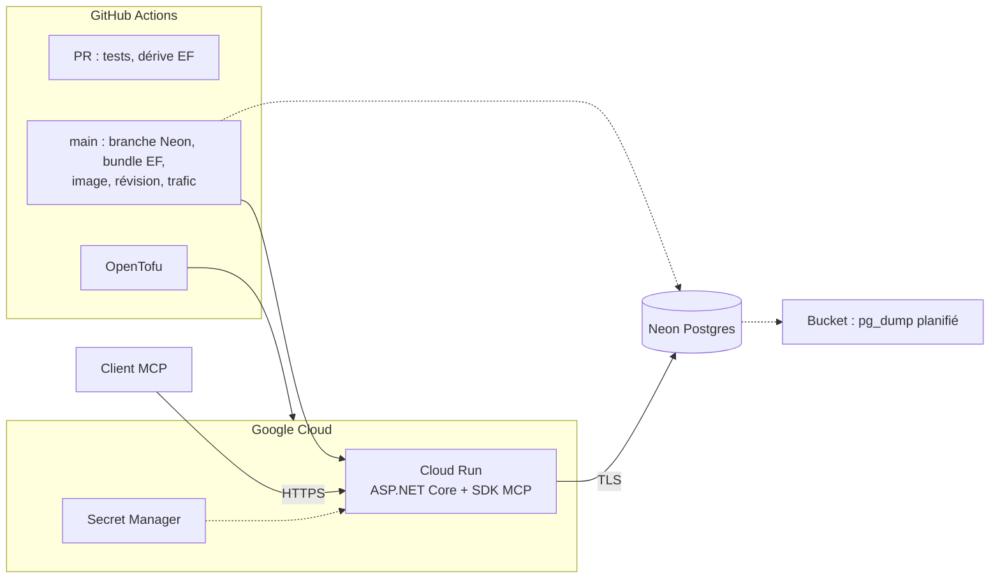

# ADR 0001 : Stack technologique du backend MCP

- **Statut :** accepté, à réviser après le spike
- **Date :** 2026-09-29
- **Issue :** [#3](https://github.com/petits-chapeaux/corvees/issues/3) (schémas d'outils hors périmètre, voir [#2](https://github.com/petits-chapeaux/corvees/issues/2))

## Contexte

Backend MCP distant (HTTPS), sans compte utilisateur, données minuscules, usage sporadique. Facteurs de décision :

- complexité minimale, dev local fiable, migrations révisables, livraison continue avec GitHub Actions et IaC;
- langage à l'ergonomie proche de Kotlin, avec un SDK MCP officiel mature;
- coût d'environ 0 $ par mois, sans essai qui expire;
- portabilité (changer d'hébergeur ou de base sans réécriture).

## Décision

| Couche | Choix |
|---|---|
| Langage | C# sur .NET 10, ASP.NET Core |
| MCP | SDK officiel C# (`ModelContextProtocol.AspNetCore`), Streamable HTTP, sans état |
| Authentification | aucune; URL de capacité `/g/{jeton}/mcp` (OAuth dans un ADR ultérieur) |
| Base de données | PostgreSQL sur Neon (plan gratuit) |
| Accès et migrations | EF Core 10 + Npgsql; migrations EF appliquées par un *bundle* en CI |
| Hébergement | Google Cloud Run (palier gratuit, scale-to-zero), conteneur standard |
| IaC et CD | OpenTofu, GitHub Actions avec Workload Identity Federation |
| Code | couches standard (Domain, Application, Infrastructure, Mcp, Host) |

## Options écartées

- **Kotlin :** premier choix, mais son SDK MCP est Tier 3, en 0.15.0, sur la spec 2025-11-25, avec des changements incompatibles à chaque version mineure. Le SDK C# est Tier 1 et suit la spec stable 2026-07-28. Kotlin Multiplatform complet (serveur natif) écarté : écosystème trop mince. Go et TypeScript (SDK Tier 1) restent de bons plans B.
- **SQLite :** les hébergeurs gratuits sans état n'ont pas de disque persistant. Postgres apporte aussi la recherche plein texte en français.
- **Autres bases gratuites :** seul Neon est permanent et se réveille seul après inactivité. Azure : 12 mois. GCP : rien. Supabase se met en pause après une semaine. Render supprime la base après 30 jours.
- **Dapper, linq2db, Marten :** inutiles à cette échelle ou inadaptés à un modèle relationnel classique.
- **Migrations SQL écrites à la main (DbUp, Flyway) :** l'issue les préfère aux migrations générées. On garde EF pour la détection de dérive du modèle, et on joint le SQL idempotent de chaque migration à la PR pour révision.
- **Azure Container Apps, Koyeb, Fly.io :** viables, moins bien sur l'IaC officiel, la portabilité ou le coût.
- **Auto-hébergement :** même conteneur derrière un tunnel sortant. Non retenu : disponibilité, sécurité et sauvegardes à notre charge.

## Neon et portabilité

Neon est du Postgres standard : `pg_dump -Fc` (connexion non poolée), `pg_restore` ailleurs, changement d'URL. Pour que cela reste vrai : SQL et extensions standard seulement, ne pas dépendre du pooleur PgBouncer en mode transaction (pas de `SET` de session, `LISTEN/NOTIFY`, `PREPARE` SQL), branches Neon réservées au pipeline.

## Déploiement

Pipeline de main : branche Neon (point de restauration), bundle de migration, image, révision à 0 % du trafic, test de fumée, bascule du trafic. Un échec laisse la révision précédente en service.

## Sécurité, observabilité, sauvegardes, retour arrière

- **Accès :** jeton haute entropie, limitation de débit, rotation, jeton masqué dans les journaux. `AllowedHosts` sur le vrai nom d'hôte, CORS désactivé.
- **Isolation :** filtre global EF sur `GroupId`, tests d'isolation. Rôle de migration (DDL) distinct du rôle applicatif.
- **Observabilité :** journaux JSON sur stdout (Cloud Logging), OpenTelemetry, filtre d'appel d'outil MCP, `/healthz` et `/readyz`.
- **Sauvegardes :** historique Neon plus `pg_dump` planifié vers un bucket, test de restauration mensuel.
- **Retour arrière :** application par rebascule du trafic vers la révision précédente; schéma en avançant (expansion/contraction), branche Neon en cas d'échec de migration.

## Risques

| Risque | Mitigation |
|---|---|
| Démarrage à froid (conteneur + réveil Neon) plus long que le délai des clients MCP | mesurer au spike; sinon instance minimale, préchauffage ou hôte toujours actif |
| Neon change son plan gratuit | Postgres standard, sauvegardes, Aiven ou hôte personnel |
| Fuite de l'URL de capacité | masquage, rotation, limitation de débit, ADR OAuth |
| Migration EF destructive | SQL révisé en PR, branche Neon avant migration |

## Conséquences

- SDK MCP Tier 1 à jour, génération de schémas, filtres et intégration d'autorisation sans contournement.
- Coût nul, hébergement et base portables.
- On perd le partage de code Kotlin Multiplatform et on accepte un runtime plus lourd que Go.
- Le choix tient en partie de la préférence : le projet voulait explorer Kotlin pour l'élégance de sa syntaxe et de sa structure. C# a beaucoup progressé, est populaire et apprécié, et offre une structure proche (types nullables, `record`, filtrage par motifs, `async/await`, LINQ). Côté SDK seul, Go ou TypeScript seraient au moins aussi solides.

## Conditions de révision

- **Base :** données proches de 0,5 Go, réveil trop lent, plan gratuit modifié.
- **Hébergement :** palier gratuit dépassé ou supprimé, démarrages à froid inacceptables. Dans ces cas, ou pour la souveraineté des données, envisager l'auto-hébergement.
- **Langage :** SDK C# sous le Tier 1, ou client natif qui partagerait le domaine (reconsidérer Kotlin si son SDK devient Tier 1 ou 2).
- **Authentification :** identité par personne, révocation, ou client qui exige OAuth.

## À valider au spike

Démarrage à froid de bout en bout, acceptation du mode sans authentification par ChatGPT, comportement de Neon à 0,5 Go et après longue inactivité, éligibilité du palier gratuit Cloud Run dans la région choisie.

## Suivi

ADR authentification, ADR interface cliente, ADR intégration LLM et MCP, squelette du dépôt (solution .NET, CI, OpenTofu), modèle de données et première migration.
