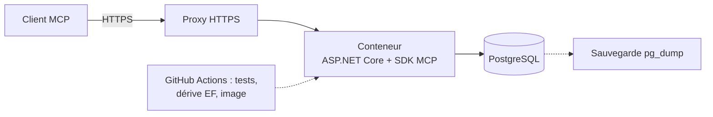

# ADR 0001 : Stack technologique du backend MCP

- **Statut :** accepté, à réviser après le spike
- **Date :** 2026-09-29
- **Issue :** [#3](https://github.com/petits-chapeaux/corvees/issues/3) (schémas d'outils hors périmètre, voir [#2](https://github.com/petits-chapeaux/corvees/issues/2))

## Contexte

Backend MCP distant (HTTPS), sans compte utilisateur, données minuscules, usage sporadique. Facteurs de décision :

- complexité minimale, dev local fiable et migrations révisables;
- langage à l'ergonomie proche de Kotlin, avec un SDK MCP officiel mature;
- coût d'environ 0 $ par mois;
- déploiement possible sur un serveur personnel comme chez un fournisseur cloud, sans réécriture.

## Décision

| Couche | Choix |
|---|---|
| Langage | C# sur .NET 10, ASP.NET Core |
| MCP | SDK officiel C# (`ModelContextProtocol.AspNetCore`), Streamable HTTP, sans état |
| Authentification | aucune; URL de capacité `/g/{jeton}/mcp` (OAuth dans un ADR ultérieur) |
| Base de données | PostgreSQL standard, hébergeur à déterminer |
| Accès et migrations | EF Core 10 + Npgsql; migrations EF appliquées par un *bundle* |
| Hébergement | Conteneur standard, cible à déterminer; un serveur personnel convient |
| Code | couches standard (Domain, Application, Infrastructure, Mcp, Host) |

## Options écartées

- **Kotlin :** premier choix, mais son SDK MCP est Tier 3, en 0.15.0, sur la spec 2025-11-25, avec des changements incompatibles à chaque version mineure. Le SDK C# est Tier 1 et suit la spec stable 2026-07-28. Kotlin Multiplatform complet (serveur natif) écarté : écosystème trop mince. Go et TypeScript (SDK Tier 1) restent de bons plans B.
- **SQLite :** Postgres apporte la recherche plein texte en français et permet de séparer l'application de son stockage sans changer de moteur.
- **Dapper, linq2db, Marten :** inutiles à cette échelle ou inadaptés à un modèle relationnel classique.
- **Migrations SQL écrites à la main (DbUp, Flyway) :** l'issue les préfère aux migrations générées. On garde EF pour la détection de dérive du modèle, et on joint le SQL idempotent de chaque migration à la PR pour révision.

## Portabilité

Le serveur est livré comme un conteneur standard et ne dépend d'aucun service propre à un hébergeur. La cible peut être un serveur personnel derrière un proxy HTTPS ou une plateforme de conteneurs gérée.

La base reste du PostgreSQL standard : `pg_dump -Fc`, `pg_restore` ailleurs et changement d'URL de connexion. SQL et extensions standard seulement; les fonctions propres à un fournisseur ou à son pooleur sont exclues.

## Déploiement

GitHub Actions vérifie les PR et produit l'image. Le mécanisme de livraison, l'application du *bundle* de migration, la gestion des secrets et le retour vers une image précédente seront définis avec la cible d'hébergement.

## Sécurité, observabilité, sauvegardes, retour arrière

- **Accès :** jeton haute entropie, limitation de débit, rotation, jeton masqué dans les journaux. `AllowedHosts` sur le vrai nom d'hôte, CORS désactivé.
- **Isolation :** filtre global EF sur `GroupId`, tests d'isolation. Rôle de migration (DDL) distinct du rôle applicatif.
- **Observabilité :** journaux JSON sur stdout, OpenTelemetry, filtre d'appel d'outil MCP, `/healthz` et `/readyz`.
- **Sauvegardes :** `pg_dump` planifié vers un stockage distinct de l'hôte, test de restauration mensuel.
- **Retour arrière :** redéploiement de l'image précédente; schéma en avançant (expansion/contraction), sauvegarde avant migration.

## Risques

| Risque | Mitigation |
|---|---|
| L'auto-hébergement rend disponibilité, sécurité et sauvegardes à notre charge | proxy HTTPS ou tunnel sortant, mises à jour régulières, supervision et sauvegardes hors hôte |
| Fuite de l'URL de capacité | masquage, rotation, limitation de débit, ADR OAuth |
| Migration EF destructive | SQL révisé en PR, sauvegarde et test de restauration avant migration |

## Conséquences

- SDK MCP Tier 1 à jour, génération de schémas, filtres et intégration d'autorisation sans contournement.
- Application et base portables entre un serveur personnel et un fournisseur cloud.
- Le déploiement, les secrets et l'exploitation restent à définir pour la cible retenue.
- On perd le partage de code Kotlin Multiplatform et on accepte un runtime plus lourd que Go.
- Le choix tient en partie de la préférence : le projet voulait explorer Kotlin pour l'élégance de sa syntaxe et de sa structure. C# a beaucoup progressé, est populaire et apprécié, et offre une structure proche (types nullables, `record`, filtrage par motifs, `async/await`, LINQ). Côté SDK seul, Go ou TypeScript seraient au moins aussi solides.

## Conditions de révision

- **Base :** PostgreSQL devient trop coûteux à exploiter pour le volume et l'usage réels.
- **Hébergement :** le conteneur standard ne peut pas respecter les contraintes de la cible choisie.
- **Langage :** SDK C# sous le Tier 1, ou client natif qui partagerait le domaine (reconsidérer Kotlin si son SDK devient Tier 1 ou 2).
- **Authentification :** identité par personne, révocation, ou client qui exige OAuth.

## À valider au spike

Acceptation du mode sans authentification par ChatGPT, déploiement du conteneur et de PostgreSQL sur la cible retenue, accès MCP distant par HTTPS et procédure de restauration.

## Suivi

ADR authentification, ADR interface cliente, ADR intégration LLM et MCP, ADR hébergement et exploitation, squelette du dépôt (solution .NET et CI), modèle de données et première migration.
