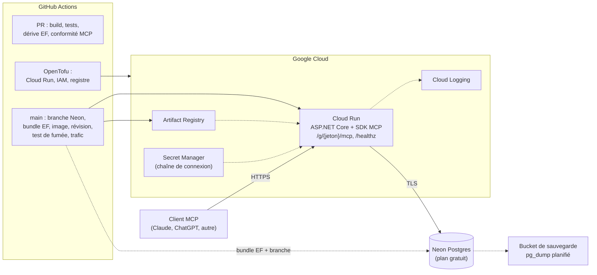

# ADR 0001 : Choix de la stack technologique du backend MCP

- **Statut :** accepté, à réviser après le spike (voir « Points à valider »)
- **Date :** 2026-09-29
- **Issue :** [#3](https://github.com/petits-chapeaux/corvees/issues/3)
- **Hors périmètre :** outils et schémas MCP publics, suivis dans [#2](https://github.com/petits-chapeaux/corvees/issues/2)

## Contexte

Corvées est un backend **MCP-first** pour une coopérative de corvées : projets, backlog, séances, décisions, outils et disponibilités. Le premier client est un chatbot IA existant connecté par MCP, donc le serveur doit être un serveur MCP **distant** en HTTPS. Les groupes se créent et se rejoignent **sans compte**.

Contraintes qui pèsent sur le choix :

- données minuscules (quelques dizaines de groupes, quelques dizaines de Mo) et trafic sporadique, avec parfois des semaines d'inactivité;
- projet personnel : viser **environ 0 $ par mois**, sans essai qui expire;
- migrations faciles à créer, réviser, appliquer et annuler; livraison continue avec GitHub Actions et de l'infrastructure décrite en code;
- documentation en français, code en anglais, produit internationalisable.

## Facteurs de décision

1. Complexité la plus basse qui permet un développement local fiable, l'évolution du schéma et un déploiement continu.
2. Ergonomie de langage proche de Kotlin (choix initial), avec un SDK MCP officiel mature.
3. Coût nul à l'échelle du projet, sans dépendre d'un essai temporaire.
4. Portabilité : pouvoir changer d'hébergeur ou de base de données sans réécriture.

## Décision

| Couche | Choix |
|---|---|
| Langage et runtime | **C# sur .NET 10** (LTS) |
| Framework MCP | **SDK MCP officiel C#** (`ModelContextProtocol.AspNetCore`), transport Streamable HTTP, mode **sans état** |
| Serveur HTTP | ASP.NET Core (minimal API) |
| Authentification | **Aucune** (URL de capacité : jeton de groupe non devinable dans la route, `/g/{jeton}/mcp`) |
| Base de données | **PostgreSQL**, hébergé sur **Neon (plan gratuit)** |
| Accès aux données | **EF Core 10 + Npgsql** |
| Migrations | **Migrations EF Core**, appliquées par un *bundle* dans le pipeline, SQL généré révisé en PR |
| Hébergement | **Google Cloud Run** (palier gratuit, scale-to-zero), conteneur standard |
| IaC et livraison | **OpenTofu** (fournisseur Google) et **GitHub Actions** avec Workload Identity Federation |
| Architecture du code | Découpage en couches standard (Domain, Application, Infrastructure, Mcp, Host) |

Kotlin Multiplatform n'est **pas** retenu : le code n'est pas partagé avec d'éventuels clients futurs.

## Options considérées

### Langage

| | C# (.NET 10) | Kotlin/JVM | Go | TypeScript |
|---|---|---|---|---|
| SDK MCP | Tier 1, v2.2.0, spec 2026-07-28 | Tier 3, 0.15.0, spec 2025-11-25 | Tier 1, v1.8.0, 2026-07-28 | Tier 1, v2.0.0, 2026-07-28 |
| Proximité de Kotlin | élevée | n/a | faible | moyenne |
| Écosystème serveur | très mature | Ktor, Spring | net/http | Hono, Express |
| Partage de code (KMP) | non | oui | non | non |

Le Kotlin/Native complet (serveur natif) a été évalué et écarté : moteur Ktor CIO seulement, pas de JDBC, Exposed, jOOQ ni Flyway, SDK Tier 3 sur une cible peu utilisée. Python, Rust et Ruby ont aussi un SDK Tier 1 à jour; ils n'ont pas été retenus faute de proximité avec Kotlin ou d'écosystème serveur comparable.

### Base de données

**Besoins de persistance (hypothèses)** : volume de l'ordre de dizaines de Mo; relations claires (groupe, membres, projets, tâches, séances, outils) avec clés étrangères; quelques utilisateurs simultanés; transactions multi-lignes (ex. compte rendu de séance); recherche plein texte légère en français; isolation par groupe (`group_id`).

| | PostgreSQL (Neon gratuit) | SQLite |
|---|---|---|
| Coût | 0 $ dans les limites | 0 $ mais exige un disque persistant, absent des hébergeurs gratuits sans état |
| Inactivité | scale-to-zero, reprise automatique | exige un hôte toujours actif |
| Recherche en français | `tsvector` avec configuration française | limitée (FTS5) |
| Sauvegardes | historique Neon + `pg_dump` planifié | à gérer soi-même (Litestream, snapshots) |
| Dev local | Docker (Testcontainers) | un fichier |
| Multi-instance | oui | non |

**PostgreSQL retenu** : maturité, fonctionnalités et coût nul. Seul inconvénient : Docker en local.

**Plans gratuits de Postgres** (vérifiés) : Neon (permanent, 0,5 Go, 100 CU-heures par mois, scale-to-zero) est le seul qui convienne. AWS offre Aurora DSQL (toujours gratuit, mais compatible et non identique à Postgres), Azure seulement 12 mois, GCP rien de permanent, Cloudflare aucun Postgres hébergé (Hyperdrive ne fait que relayer). Supabase met en pause après une semaine d'inactivité et Render supprime la base après 30 jours, ce qui ne convient pas à une coopérative parfois inactive.

**Neon n'est pas un verrou.** C'est du Postgres standard : `pg_dump -Fc` (avec la chaîne de connexion **non poolée**) puis `pg_restore` ailleurs, et on change l'URL de connexion. Précautions pour que cela reste vrai :

- n'utiliser que du SQL et des extensions Postgres standard;
- Neon fournit un pooleur PgBouncer en mode transaction (pas de `SET` de session, `LISTEN/NOTIFY`, `PREPARE` SQL ni tables temporaires entre transactions) : ne pas en dépendre dans le code;
- les branches Neon ne servent qu'au pipeline (point de restauration avant migration) et sont remplaçables par un `pg_dump`.

### Accès aux données et migrations

| Accès | Avantages | Inconvénients |
|---|---|---|
| **EF Core 10 + Npgsql** (retenu) | LTS, LINQ, transactions, filtres globaux (isolation par `GroupId`), jetons de concurrence optimiste, stratégie de reprise pour le premier accès après inactivité, migrations intégrées | abstraction à surveiller (SQL généré) |
| Dapper | SQL explicite, très léger | tout à écrire soi-même, pas de migrations |
| linq2db | LINQ proche du SQL, fonctions Postgres avancées | plus petit écosystème, inutile à cette échelle |
| Marten | Postgres en base documentaire ou événementielle | inadapté à un modèle relationnel classique |

| Migrations | Avantages | Inconvénients |
|---|---|---|
| **Migrations EF Core** (retenu) | modèle et schéma synchronisés, détection de dérive en CI (`dotnet ef migrations has-pending-model-changes`), *bundle* exécutable avec verrou, script SQL idempotent révisable | migrations générées automatiquement; méthodes `Down` rarement exercées |
| DbUp, Evolve | SQL versionné à la main, indépendant de l'ORM | pas de détection de dérive sans tests dédiés |
| FluentMigrator | migrations en C# fluide, multi-bases | DSL supplémentaire |
| Flyway | SQL versionné, indépendant du langage | annulation (`undo`) réservée aux éditions payantes |

**Écart assumé** par rapport à l'issue, qui préfère des migrations indépendantes de la génération automatique de l'ORM : on garde les migrations EF pour la synchronisation modèle/schéma, et on neutralise le risque en joignant **le SQL idempotent de chaque migration à la PR** pour révision. Retour arrière : **avancer** (jamais de modification d'une migration livrée, approche expansion/contraction), avec une branche Neon comme point de restauration avant chaque migration. Les migrations s'exécutent dans une étape distincte du pipeline, jamais au démarrage de l'application.

### Framework MCP

Le SDK officiel C# répond à chaque point demandé par l'issue :

| Exigence | Constat |
|---|---|
| Transport | Streamable HTTP via `AddMcpServer().WithHttpTransport()` et `MapMcp()`; mode sans état par défaut (recommandé quand on n'a pas besoin de requêtes serveur vers client) |
| Enregistrement des outils | attributs `[McpServerToolType]` et `[McpServerTool]`, injection de dépendances dans les outils |
| Schémas | générés depuis les signatures de méthodes, `[Description]` pour les descriptions, sortie structurée possible, JSON Schema 2020-12 |
| Gestion d'erreurs | exceptions converties en résultats d'outil (message générique), `McpProtocolException` pour les erreurs JSON-RPC |
| Observabilité | filtres de requêtes et de messages (journalisation, mesure, limitation de débit), `ILogger`, télémétrie ASP.NET Core |
| Autorisation | intégration ASP.NET Core (JWT, métadonnées de ressource protégée, `[Authorize]`); **aucun serveur d'autorisation fourni** |
| Déploiement | application ASP.NET Core ordinaire, conteneur |
| Versionnement | SemVer avec politique de changements incompatibles documentée |

Le SDK officiel Kotlin (Tier 3, 0.15.0, spec 2025-11-25, changements incompatibles à chaque version mineure, sans génération de schémas ni aide à l'autorisation côté serveur) a été le premier choix examiné et n'a pas été retenu.

### Authentification

La partie « serveur de ressources » d'OAuth est simple avec le SDK C# (environ une dizaine de lignes). La partie « serveur d'autorisation » n'est pas fournie : Claude et ChatGPT attendent un flux OAuth découvrable, ce qui exige un fournisseur d'identité et un modèle d'accès anonyme « rejoindre par lien ». Ce n'est pas trivial, donc **on démarre sans authentification**, avec une URL de capacité : jeton haute entropie dans la route, comparaison à temps constant, limitation de débit, rotation du jeton, jeton masqué dans les journaux. Ajouter OAuth plus tard ne touche pas au code des outils (intergiciel ASP.NET Core standard).

Claude accepte les serveurs sans authentification. Pour ChatGPT, à confirmer au spike.

### Hébergement, IaC et livraison

| Forme | Avantages | Inconvénients |
|---|---|---|
| **Cloud Run + Neon** (retenu) | palier gratuit permanent (2 M de requêtes, 180 000 vCPU-s, 360 000 GiB-s par mois), scale-to-zero, révisions avec répartition du trafic pour un retour arrière instantané, fournisseur IaC officiel, actions GitHub Google avec Workload Identity Federation, simple conteneur portable | compte de facturation Google avec carte, démarrage à froid .NET + réveil Neon à mesurer |
| Azure Container Apps + Neon | même taille de palier gratuit, outillage .NET natif, chemin vers Entra ID | plus de concepts Azure (environnement, Log Analytics), Postgres Azure gratuit seulement 12 mois |
| Koyeb (instance gratuite) + Neon | le moins de cérémonie | 0,1 vCPU, « pas pour la production », IaC et retour arrière faibles |
| Fly.io + Neon | excellente ergonomie | pas gratuit (environ 4 à 7 $ par mois), fournisseur Terraform officiel non maintenu |
| **Auto-hébergement** | coût fixe nul, contrôle total, aucune carte | disponibilité liée à la maison (coupures, mises à jour), exposition à sécuriser (tunnel sortant type Cloudflare Tunnel), sauvegardes et supervision à gérer, service qui dépend d'une seule personne |

**Cloud Run retenu.** L'auto-hébergement est une option considérée, pas retenue : le conteneur et Postgres standard rendent le passage possible à tout moment (voir conditions de révision).

## Diagramme de déploiement

## Chemin de déploiement minimal

1. **Structure :** `src/Corvees.Domain`, `Application`, `Infrastructure` (EF Core, migrations), `Mcp` (outils comme adaptateurs minces), `Host` (ASP.NET Core), `tests/`, `infra/`.
2. **Local :** `docker compose up` pour Postgres, `dotnet run` pour l'hôte; tests avec Testcontainers.
3. **CI (PR) :** build, tests, `has-pending-model-changes`, SQL idempotent des nouvelles migrations joint à la PR, tests de conformité MCP.
4. **CD (main) :** créer une branche Neon, exécuter le bundle de migration, construire et pousser l'image, déployer une révision à 0 % du trafic, test de fumée (`tools/list`), basculer le trafic, supprimer la branche. En cas d'échec, la révision précédente continue de servir.
5. **Infra :** OpenTofu avec un bucket d'état; secrets dans Secret Manager; projet Neon créé une fois à la main (le fournisseur OpenTofu de Neon est communautaire).
6. **Environnements :** préproduction et production, même image, configuration différente.

## Sécurité, observabilité, sauvegardes, migrations, retour arrière

| Sujet | Approche |
|---|---|
| Accès au point d'entrée | URL de capacité, limitation de débit par jeton et par IP, rotation du jeton |
| HTTP | `AllowedHosts` sur le vrai nom d'hôte (Kestrel ne valide pas l'en-tête Host par défaut), CORS désactivé, taille de requête limitée, HTTPS seulement |
| Isolation des groupes | filtre global EF sur `GroupId`, tests d'isolation entre groupes |
| Rôles de base de données | rôle de migration (DDL) séparé du rôle applicatif (DML seulement) |
| Secrets | Secret Manager; GitHub Actions par OIDC, aucune clé cloud stockée |
| Journaux | JSON structuré sur stdout via `ILogger`, collecté par Cloud Logging; jeton masqué; identifiant de corrélation depuis `traceparent` |
| Métriques et traces | OpenTelemetry (ASP.NET Core, Npgsql) et un filtre d'appel d'outil MCP (durée, taux d'erreur) |
| Santé | `/healthz` (processus), `/readyz` (base joignable), sonde de démarrage Cloud Run |
| Sauvegardes | historique Neon en première ligne, `pg_dump -Fc` planifié vers un bucket, test de restauration mensuel |
| Retour arrière applicatif | rebasculer le trafic Cloud Run vers la révision précédente |
| Retour arrière du schéma | avancer; restaurer depuis la branche Neon créée avant la migration si la migration échoue |
| Reprise après inactivité | stratégie de reprise EF/Npgsql sur la première connexion |
| Internationalisation | clés de messages, UTF-8 partout, configuration française de recherche plein texte |

## Risques et mitigations

| Risque | Mitigation |
|---|---|
| Démarrage à froid (conteneur .NET + réveil Neon) dépasse le délai d'attente des clients MCP | mesurer au spike; sinon instance minimale, ping de préchauffage planifié, ou hôte toujours actif (auto-hébergement, Fly.io) |
| Neon change ou limite son plan gratuit | Postgres standard, sauvegardes, alternatives (Aiven, Azure, hôte personnel) |
| Fuite de l'URL de capacité | masquage dans les journaux, rotation, limitation de débit, ADR OAuth ensuite |
| Migration EF destructive | révision du SQL généré en PR, branche Neon avant migration, expansion/contraction |
| Facturation inattendue du palier gratuit (sortie réseau, journaux, registre) | alerte de budget à 1 $, suivi après la première semaine |
| Perte de l'option Kotlin Multiplatform | couches propres pour pouvoir porter le domaine; condition de révision ci-dessous |
| Dépendance à plusieurs fournisseurs (Google, Neon, GitHub) | tout est un conteneur et du Postgres standard |

## Conséquences

- On gagne un SDK MCP Tier 1 à jour avec la spec stable 2026-07-28, la génération de schémas, les filtres et l'intégration d'autorisation, sans contournement.
- Coût nul à l'échelle du projet; hébergement et base portables.
- On perd le partage de code Kotlin Multiplatform et on accepte un runtime plus lourd que Go.
- L'authentification par URL de capacité est un compromis temporaire; OAuth fera l'objet d'un ADR distinct.
- Le choix du langage tient en partie de la préférence : le projet voulait explorer Kotlin pour l'élégance de sa structure et de sa syntaxe. C# a beaucoup progressé ces dernières années, est populaire, apprécié de ses utilisateurs et offre une structure de code et une syntaxe élégantes proches de celles de Kotlin (types nullables, `record`, filtrage par motifs, `async/await`, LINQ, méthodes d'extension). Si l'on exigeait un choix strictement neutre, Go ou TypeScript seraient au moins aussi solides côté SDK.

## Conditions de révision

**Base de données**

- les données approchent 0,5 Go ou les CU-heures approchent 100 par mois;
- la latence de reprise après inactivité devient inacceptable;
- Neon change les conditions du plan gratuit (migrer par `pg_dump` et changement d'URL);
- besoin d'une restauration à un instant donné au-delà de la fenêtre gratuite, ou d'un SLA.

**Hébergement**

- le palier gratuit de Cloud Run est dépassé ou supprimé;
- les démarrages à froid cassent les délais des clients MCP et une instance chaude coûterait trop cher;
- **passage à l'auto-hébergement** (même conteneur sur un serveur personnel derrière un tunnel sortant, Postgres Neon ou local) si l'un de ces cas se présente, ou si l'on préfère la souveraineté des données et un coût fixe nul, en acceptant la responsabilité de la disponibilité, de la sécurité et des sauvegardes.

**Langage et SDK**

- le SDK C# passe sous le Tier 1 ou ses changements deviennent pénibles;
- un client natif qui partagerait le code du domaine devient réel : reconsidérer Kotlin quand son SDK sera Tier 1 ou 2 et prendra en charge la spec courante.

**Authentification**

- besoin d'identité par personne ou de révocation, ou un client exige OAuth : nouvel ADR avec fournisseur d'identité.

## Points à valider (spike, environ une journée, après l'ADR)

- Démarrage à froid de bout en bout (conteneur + Neon) face aux délais d'attente de Claude et ChatGPT.
- Acceptation d'un serveur sans authentification par ChatGPT.
- Comportement de Neon à la limite de 0,5 Go, après une longue inactivité, et durée de la fenêtre d'historique gratuite.
- Éligibilité du palier gratuit Cloud Run pour la région choisie (proche de Neon).
- Télémétrie OpenTelemetry intégrée au SDK C#, action ou API Neon pour créer et supprimer une branche en CI, gratuité de Secret Manager.

## Suivi (sans décider les schémas d'outils, voir #2)

- ADR : modèle d'authentification (URL de capacité aujourd'hui, OAuth plus tard).
- ADR : interface cliente (chatbot existant ou frontend dédié).
- ADR : intégration LLM et MCP.
- Squelette du dépôt : solution .NET, workflow CI, Dockerfile ou publication de conteneur par le SDK, base OpenTofu.
- Conventions de schémas d'entrée et de sortie des outils à partir des schémas générés par le SDK (lié à #2).
- Modèle de données initial et première migration EF.

## Sources

[SDK MCP C#](https://csharp.sdk.modelcontextprotocol.io/), [niveaux des SDK](https://modelcontextprotocol.io/community/sdk-tiers), [spec 2026-07-28](https://modelcontextprotocol.io/specification/2026-07-28/changelog), [limites du plan gratuit Neon](https://neon.com/faqs/free-plan-limits-and-quotas), [export Neon compatible Postgres](https://neon.com/docs/guides/export-neon-postgres-compatible), [pooleur Neon](https://neon.com/faqs/postgres-services-built-in-connection-pooling), [tarification Cloud Run](https://cloud.google.com/run/pricing), [application des migrations EF Core](https://learn.microsoft.com/en-us/ef/core/managing-schemas/migrations/applying).
